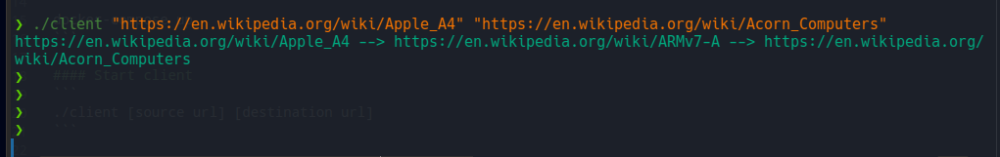

### Wikipedia path finder

This app finds path between two pages on wikipedia. Uses message-queue pattern for handling client requests.
#### Install dependences
```
go mod download && go mod verify
```

#### Build
```
go build ./
```

#### Start server
```
docker-compose up
```

#### Start client
```
./client [source url] [destination url]
```

#### Example
